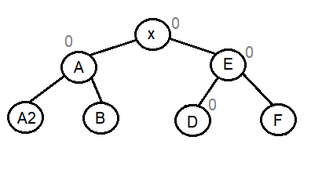

## Árvore AVL (Árvore balanceada de busca)

### Resumo da remoção de nó com 2 filhos e balanceamento

#### Remoção de nó com 2 filhos (Com balanceamento -1)
 
Passamos C para a função de remover, com o objetivo de remover o elemento D. Ao remover o elemento D, teremos uma diminuição da altura que será passada para C. Como C tem balanceamento -1, então o balanceamento de C será alterado para 0 e retornará para X dizendo que a altura diminuiu.

Como X tem balanceamento 1 e houve uma diminuição da altura na direita, então o balanceamento de X fica sendo 0.

#### Remoção de nó com 2 filhos (Com balanceamento 0)

Passamos C para a função de remover, com o objetivo de remover o elemento D. Assim, ao remover o elemento D, terá uma diminuição da altura que será passada para C. Como o balanceamento de C é 0 e houve uma diminuição da altura por conta da remoção na esquerda, então o bal de C será 1 e retornará para X dizendo que não houve diminuição da altura.

#### Remoção de nó com 2 filhos (Com balanceamento 1 e rotação para a esquerda)

Passamos C para a função de remover, com o objetivo de remover o elemento D. Ao remover o elemento D, será retornado para C dizendo que houve uma diminuição da altura. Como o balanceamento de C é 1 e houve uma diminuição da altura na esquerda, então o algoritmo irá verificar o balanceamento de E para realizar as devidas rotações.

Se o balanceamento de E for 1, então será realizada uma rotação para a esquerda entre C e E. Nesse caso, o nó C (Em que devemos colocar o valor/chave de D) estará agora na esquerda da nova raiz atualizada (Após a rotação) que é E. Por isso, o valor/chave de D, que foi guardado antes de removê-lo, agora será colocado na esquerda da raiz atual (Posição em que C está após a rotação para a esquerda).

Após a rotação, retornaremos para X dizendo que a altura diminuiu e portanto, se o balanceamento de X era 1, agora ficará 0 por conta da diminuição da altura na subárvore da direita.

#### Remoção de nó com 2 filhos (Com balanceamento 1 e rotação direita-esquerda)

Passamos C para a função de remover, com o objetivo de remover o elemento D. Ao remover o elemento D, será retornado para C dizendo que houve uma diminuição da altura. Como o balanceamento de C é 1 e houve uma diminuição da altura na esquerda, então o algoritmo irá verificar o balanceamento de E para realizar as devidas rotações.

Se o balanceamento de E for -1, então será realizada uma rotação direita-esquerda, colocando F no lugar de C. Da mesma forma, C estará agora na esquerda da nova raiz atualizada (F). Portanto, o valor/chave de D, que foi guardado antes de removê-lo, será colocado na esquerda da nova raiz atualizada (Posição em que C está após a rotação).

Após a rotação direita-esquerda, retornaremos para X dizendo que houve uma diminuição da altura. Por isso, se o balanceamento de X era 1, então ficará 0.

